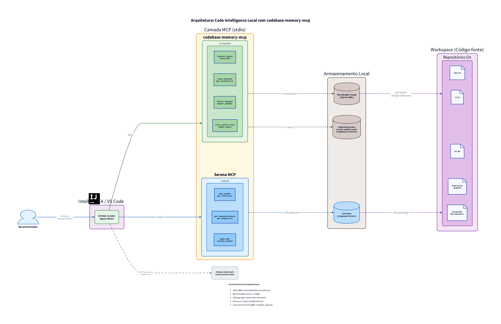

# Arquitetura da Solução: Code Intelligence Local com GitHub Copilot e MCP

## Visão Geral



A solução implementa um sistema de **code intelligence** 100% local, baseado em knowledge graph, que se integra nativamente ao IntelliJ IDEA através do GitHub Copilot Chat usando o Model Context Protocol (MCP). A arquitetura foi desenhada especificamente para ambientes restritos: Windows 11 sem privilégios de administrador e sem Docker.

A abordagem evoluiu de um sistema de RAG vetorial (mcp-vector-search + Ollama + LanceDB) para um **knowledge graph persistente** (codebase-memory-mcp), que combina busca semântica, análise estrutural e cross-service linking em um único binário estático sem dependências.

## Componentes da Arquitetura

1. **IntelliJ IDEA + GitHub Copilot Plugin**:
   - Atua como a interface principal do usuário.
   - O Copilot Chat em "Agent Mode" envia prompts e delega a busca semântica e análise estrutural para os servidores MCP configurados localmente.
   - Utiliza a configuração `~/.config/github-copilot/intellij/mcp.json` para conectar-se aos servidores MCP locais.

2. **codebase-memory-mcp (Motor de Code Intelligence)**:
   - Binário estático único (C puro) que indexa o código-fonte em um knowledge graph persistente (SQLite).
   - **Embedding integrado**: Modelo `nomic-embed-code` (768 dimensões, int8) compilado diretamente no binário — sem download, sem dependências externas.
   - **158 linguagens**: Grammars tree-sitter vendored e compilados no binário.
   - **Hybrid LSP**: Resolução semântica de tipos para Python, TypeScript/JavaScript, Go, Java, Kotlin, C#, Rust, C, C++, PHP.
   - **14 ferramentas MCP**: `search_graph`, `semantic_query`, `trace_call_path`, `get_architecture`, `detect_changes`, `query_graph`, `search_code`, `get_code_snippet`, `manage_adr`, `dead_code`, `cross_service`, `similar_code`, `community_detect`, `ingest_traces`.
   - **Cross-service linking**: Detecta comunicação HTTP, gRPC, GraphQL e pub-sub entre serviços automaticamente.
   - **Infrastructure-as-code**: Indexa Dockerfiles, Kubernetes manifests e Kustomize overlays como nós do grafo.
   - **Auto-sync**: Mantém o índice atualizado via git-based change detection.

3. **Serena MCP (Navegação LSP Determinística)**:
   - Servidor MCP patrocinado pela Microsoft que utiliza o Language Server Protocol (LSP).
   - Fornece navegação determinística complementar: `find_symbol`, `find_references`, `find_implementations`, `symbol_overview`.
   - Instala-se via `uv` sem privilégios de administrador.

4. **Ollama (Opcional — LLM Local)**:
   - Motor de execução de LLMs locais para chat/completion.
   - **Não é mais necessário para code intelligence** (embedding e busca). Utilizado apenas se o desenvolvedor desejar um LLM local para chat.
   - Pode ser instalado no Windows no diretório do usuário, sem necessidade de privilégios administrativos.

5. **GitHub Copilot Custom Agents (.github/agents)**:
   - Instruções customizadas em Markdown que definem "personas" ou "agentes" específicos para o Copilot.
   - Inclui prompts especializados para análise arquitetural, mapeamento de microserviços e análise de impacto.

## Fluxo de Dados

1. **Ingestão (Indexação)**:
   - O desenvolvedor executa `codebase-memory-mcp index` no diretório do projeto (ou a indexação ocorre automaticamente na primeira busca).
   - O codebase-memory-mcp realiza parsing AST via tree-sitter (158 linguagens), extrai funções, classes, imports, call chains, HTTP routes e cross-service links.
   - Gera embeddings vetoriais (nomic-embed-code, 768d) para cada símbolo e trecho de código.
   - Constrói um knowledge graph persistente em SQLite com nós (Function, Class, Module, Route, Resource) e arestas (CALLS, IMPORTS, DEFINES, IMPLEMENTS, INHERITS, HTTP_CALLS, EMITS, LISTENS_ON, DATA_FLOWS, SIMILAR_TO).
   - O índice é mantido atualizado automaticamente via git-based change detection.

2. **Consulta (Code Intelligence)**:
   - O desenvolvedor faz uma pergunta no IntelliJ Copilot Chat (Agent Mode).
   - O Copilot invoca automaticamente as ferramentas MCP mais adequadas:
     - `semantic_query` para busca por linguagem natural ("onde a senha é validada?")
     - `trace_call_path` para call graph ("quem chama este método?")
     - `get_architecture` para visão geral ("qual a arquitetura deste serviço?")
     - `detect_changes` para análise de impacto ("o que minha mudança afeta?")
     - `cross_service` para comunicação entre serviços ("quem consome este endpoint?")
   - O codebase-memory-mcp responde em <1ms com resultados precisos do knowledge graph.
   - O Copilot LLM sintetiza a resposta final com base no contexto estruturado e a exibe no IntelliJ.

## Justificativa das Escolhas Tecnológicas

- **Sem Docker e Sem Admin**: O codebase-memory-mcp é um binário estático único que não requer instalação de runtime (Python, Node.js, Java). Instala-se em `%LOCALAPPDATA%` sem elevação de privilégios.
- **Zero Dependências**: Diferente da solução anterior (Python venv + sentence-transformers + LanceDB), o binário é auto-contido. Grammars tree-sitter, modelo de embedding e banco SQLite estão todos embutidos.
- **Gratuidade e Privacidade**: Todos os componentes são open-source e gratuitos (MIT). O código-fonte nunca sai da máquina para ser indexado, garantindo privacidade total.
- **Performance**: Indexa repositórios médios em milissegundos. O Linux kernel (28M LOC, 75K arquivos) é indexado em 3 minutos. Queries respondem em <1ms.
- **Redução de Tokens**: Benchmarks demonstram 99% de redução no consumo de tokens vs. exploração file-by-file, resultando em respostas mais rápidas e menor custo de API.
- **Integração Copilot/IntelliJ**: O suporte a MCP no GitHub Copilot para JetBrains (plugin v1.5.57+) permite que o Copilot acesse as 14 ferramentas locais de forma padronizada via stdio.
- **Team Sharing**: O knowledge graph comprimido (`.codebase-memory/graph.db.zst`) pode ser commitado no git, permitindo que colegas façam incremental diff ao invés de full reindex.

## Diagrama Simplificado

```
┌─────────────────────────────────────────────────────────────────────┐
│                    IntelliJ IDEA + GitHub Copilot                    │
│                         (Agent Mode + MCP)                           │
└──────────────────────────────┬──────────────────────────────────────┘
                               │ MCP (stdio)
                ┌──────────────┴──────────────┐
                │                             │
                ▼                             ▼
┌───────────────────────────┐  ┌───────────────────────────┐
│   codebase-memory-mcp     │  │       Serena MCP          │
│                           │  │                           │
│  · Knowledge Graph        │  │  · find_symbol            │
│  · Busca Semântica        │  │  · find_references        │
│  · Call Graph             │  │  · find_implementations   │
│  · Cross-Service Links    │  │  · symbol_overview        │
│  · Análise de Impacto     │  │                           │
│  · Architecture Overview  │  │  (Language Server Proto)  │
│                           │  │                           │
│  [Binário estático, C]    │  │  [Python via uv]          │
│  [SQLite + tree-sitter]   │  │                           │
│  [nomic-embed-code 768d]  │  │                           │
└───────────────────────────┘  └───────────────────────────┘
```
